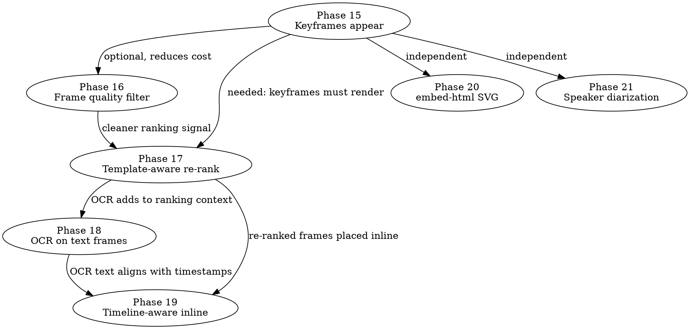

# Video frame analysis — macro plan (Phases 15-21)

This is the **index** for the seven-phase sequence that completes the
video-frame analysis pipeline started in Phase 13 (scene detection,
vision call, keyframe upload) and continued in Phase 14 (templates as
the consumer of those keyframes).

The diagnostic + tier rationale lives in
[`2026-05-12-video-frame-analysis-roadmap.md`](2026-05-12-video-frame-analysis-roadmap.md).
Each phase below maps 1:1 to a tier in that roadmap; the order is
cost-vs-impact (Tier 1 → 5 → 2 → 3 → 4 → 6 → 7).

Phase numbering follows the project convention: each phase ships as its
own focused PR with a detailed [`writing-plans`](../../.) implementation
plan written when the phase begins.

---

## Sequence

```
┌──────── Phase 15 ────────┐    ┌──────── Phase 16 ────────┐
│ Tier 1: Keyframes appear │ ─▶ │ Tier 5: Frame quality    │
│ Make the default flow    │    │ Black/dupe/low-entropy   │
│ surface keyframes        │    │ pre-filter before vision │
└──────────────────────────┘    └──────────────────────────┘
                                              │
                                              ▼
┌──────── Phase 17 ────────┐    ┌──────── Phase 18 ────────┐
│ Tier 2: Template-aware   │ ─▶ │ Tier 3: OCR on text-rich │
│ keyframe re-ranking      │    │ frames                   │
└──────────────────────────┘    └──────────────────────────┘
                                              │
                                              ▼
                                ┌──────── Phase 19 ────────┐
                                │ Tier 4: Timeline-aware   │
                                │ inline keyframe embed    │
                                │ (map-reduce integration) │
                                └──────────────────────────┘
                                              │
                                              ▼
┌──────── Phase 20 ────────┐    ┌──────── Phase 21 ────────┐
│ Tier 6: embed-html SVG   │    │ Tier 7: Speaker          │
│ symbolic visualizations  │    │ diarization              │
│ (specialized templates)  │    │ (multi-speaker support)  │
└──────────────────────────┘    └──────────────────────────┘
```

Phases 15-19 are strictly sequential — each builds on the previous one's
outputs. Phases 20-21 are independent end-state capabilities; either can
be done after Phase 19 (or after Phase 17) without blocking the others.

**Total effort estimate** (from the roadmap, with 30% buffer):
~55-75 hours of focused work spread over ~4-6 weeks.

---

## Phase 15 — Tier 1: Make keyframes actually appear

**Goal.** Today the vision pipeline runs (cost: ~$0.05/video) but
keyframes almost never appear in rendered AFFiNE docs because templates
don't actively request them. Phase 15 fixes this with two complementary
mechanisms.

**Files (rough):**
- Create: `ingest/migrations/0006_seed_prompt_v5_keyframes.sql` — update
  the `(*, *)` seed prompt with explicit "embed 2-4 keyframes inline when
  they support the surrounding text" rule.
- Modify: `ingest/src/pipeline/orchestrator.py` — `_replace_doc_body_templated`
  gains a fallback `## Keyframes` appendix when the rendered `body_md`
  references zero `kf:N` out of N available.
- Modify: `ingest/src/api.py` — same fallback inside the rerender endpoint.
- Modify: `ingest/tests/test_orchestrator.py` — 2 new tests covering both
  the appendix-emitted path and the appendix-skipped path.

**Acceptance:**
- Capturing a YouTube video with `keyframes != []` produces an AFFiNE doc
  containing at least one inline `affine:image` block OR a `## Keyframes`
  appendix with the top-3 by importance.
- Capturing a video whose template (synthesized or edited) explicitly
  uses `kf:N` inline → no appendix; the inline embeds appear in the
  expected positions.
- Re-running migrations is idempotent (existing seed updates only when
  status='auto').

**Out of scope:**
- Template-aware re-ranking (Phase 17).
- Keyframe pre-filtering (Phase 16).
- Inline keyframe placement at transcript timestamps (Phase 19).

**Effort:** ~2-4 hours. Single PR.

**Status:** ✅ Shipped (commit `0882ec7`).
**Detailed plan:** [`2026-05-12-phase-15-keyframes-appear.md`](2026-05-12-phase-15-keyframes-appear.md)

---

## Phase 16 — Tier 5: Frame-quality pre-filter

**Goal.** Drop obviously uninformative frames (mostly-black, near-duplicate,
low-entropy) before the Sonnet vision call runs. Reduces vision cost by
~30-40% and improves the per-frame importance signal.

**Files:**
- Create: `ingest/src/pipeline/video_analysis_filters.py` — three pure
  numpy-based filters (blackness, perceptual-hash dedup, Shannon entropy).
- Modify: `ingest/src/pipeline/video_analysis.py` — insert filter call
  between `_detect_and_extract_frames()` and `_vision_call()`.
- Modify: `ingest/pyproject.toml` — add `imagehash>=4.3` dependency.
- Modify: `ingest/src/config.py` — three new settings:
  `frame_blackness_threshold`, `frame_dedup_hamming_distance`,
  `frame_entropy_threshold`.
- Create: `ingest/tests/test_video_analysis_filters.py` — synthesize
  black/uniform/duplicate test images, verify each filter triggers.

**Acceptance:**
- For a video with N raw scene-cut frames, the vision call receives only
  the frames that survive all three filters (verified via logs).
- Synthetic test cases (all-black image, uniform-gray image, two
  bit-for-bit identical frames) all get filtered.
- A genuinely distinct content frame is NEVER filtered.

**Out of scope:**
- Vision-call cost telemetry (could add but not required for v1).
- Filtering driven by template purpose (overlaps with Phase 17).

**Effort:** ~3-5 hours. Single PR.

**Status:** ✅ Shipped (commit `47ebc1b`).
**Detailed plan:** [`2026-05-12-phase-16-frame-quality-filter.md`](2026-05-12-phase-16-frame-quality-filter.md)

---

## Phase 17 — Tier 2: Template-aware keyframe re-ranking

**Goal.** The vision call knows which template the capture is destined
for and re-ranks frame importance accordingly. YouTube tutorial → IDE
shots score higher than speaker faces. Recipe → ingredients shot +
final plate score higher than chef's face. Etc.

**Files:**
- Modify: `ingest/src/pipeline/orchestrator.py` — restructure flow:
  ```
  extract → classify → resolve_template → IF VIDEO: re-run vision call
  with template-aware prompt → render
  ```
- Modify: `ingest/src/pipeline/video_analysis.py` — `analyze_video()`
  gains optional `template_purpose: str` kwarg. Vision call's system
  prompt embeds the purpose.
- Modify: `ingest/src/pipeline/extractors/cobalt_ext.py` — pass through
  the new kwarg.
- Modify: `ingest/src/pipeline/extracted.py` — `extra["keyframes"]` now
  carries the re-ranked top-N (replacing the original generic ranking).
- Frame preservation: keep raw JPEG bytes long enough for the second
  vision pass to score them. Options decided during the detailed plan.
- Modify: `ingest/tests/test_video_analysis.py` — verify the system
  prompt includes template-specific purpose language.

**Acceptance:**
- A YouTube/Tutorial capture's `keyframes[]` is ranked by the tutorial
  template's purpose — IDE screenshots before speaker frames.
- A test using a stock recipe video confirms re-ranking changes the
  top-N vs. a generic prompt.
- Cost: one extra Sonnet vision call per video. Documented in the
  detailed plan with a feature flag (`VIDEO_RERANK_ENABLED=true` default).

**Open architectural decision in the detailed plan:**
- (a) Cheap pre-classification (URL + first sentence) → resolve template
  → ONE vision call.
- (b) Two-pass: existing generic vision call → classify → resolve
  template → re-run vision call (additive cost, simpler reasoning).
- Recommended: (b). Settled when writing the detailed plan.

**Out of scope:**
- OCR (Phase 18).
- Timeline-aware inline placement (Phase 19).
- Per-chunk re-ranking inside chunked_render (Phase 19).

**Effort:** ~6-10 hours. Single PR.

**Detailed plan:** `docs/plans/2026-05-12-phase-17-template-aware-keyframes.md` (TBD)

---

## Phase 18 — Tier 3: OCR on text-rich frames

**Goal.** When a vision-call caption mentions "slide", "code on
screen", "diagram", "chart", "title card" — run an OCR pass and surface
the transcribed text in keyframe metadata. Makes on-screen text part
of the template's render context.

**Files:**
- Create: `ingest/src/pipeline/keyframe_ocr.py` — module deciding which
  frames to OCR + running the OCR pass (cloud variant via Anthropic
  vision, with a Tesseract fallback path documented).
- Modify: `ingest/src/pipeline/video_analysis.py` — `KeyframeRef` gains
  `ocr_text: str | None`. After vision-call importance ranking, walk the
  kept frames + caption keywords; OCR the matches.
- Modify: `ingest/src/pipeline/extracted.py` — keyframes dict shape
  carries the new `ocr_text` field (backwards compatible — None on old).
- Modify: `ingest/src/pipeline/templated_render.py` + `chunked_render.py`
  — surface OCR'd text alongside captions in the LLM user message
  ("[N] t=... — caption / OCR: «text»").
- Modify: `ingest/migrations/0007_seed_prompt_v6_ocr.sql` — seed prompt
  gains a "when OCR text is provided, quote it verbatim in body_md" rule.
- Modify: `ingest/tests/test_keyframe_ocr.py` — mock OCR; verify caption
  keyword detection triggers OCR; verify text reaches user message.

**Acceptance:**
- A tutorial video with code-on-screen frames produces body_md that
  quotes the code snippet verbatim.
- A documentary with stat slides surfaces those stats as numbered text,
  even without the user clicking through to the image.
- OCR opt-out via `KEYFRAME_OCR_ENABLED=false` config flag.

**Cost:** ~$0.01 per OCR'd frame (Anthropic vision variant).

**Out of scope:**
- Inline timeline placement (Phase 19).
- OCR-driven re-ranking (could be future Tier 8).

**Effort:** ~6-8 hours. Single PR.

**Detailed plan:** `docs/plans/2026-05-12-phase-18-keyframe-ocr.md` (TBD)

---

## Phase 19 — Tier 4: Timeline-aware inline keyframe embedding

**Goal.** Keyframes appear INLINE in `body_md` at the matching
transcript timestamp, not just as a flat list at the top of the doc.
For the map-reduce path, each chunk gets only its time-window keyframes.

**Files:**
- Modify: `ingest/src/pipeline/chunked_render.py`:
  - Chunker filters keyframes by `timestamp_seconds` range per chunk.
  - `ChunkSummary` gains `keyframe_refs: list[str]` (e.g. `["kf:2", "kf:4"]`).
  - Reducer's user message includes per-chunk keyframe refs.
- Modify: `ingest/src/pipeline/templated_render.py` (single-call path):
  - User message provides keyframes with timestamps + worked example of
    inline placement.
- Modify: `ingest/migrations/0008_seed_prompt_v7_timeline.sql` — seed
  prompt's keyframe rule gets a "embed inline at the matching
  transcript timestamp; do not cluster them at the top" instruction.
- Modify: `ingest/tests/test_chunked_render.py` — chunker timestamp-range
  assignment; map step preserving keyframe_refs; reducer preserving
  per-section refs in body_md.

**Acceptance:**
- A 30-minute video with 6 keyframes scattered across the timeline
  produces a body_md where each `kf:N` ref appears in the section
  whose timestamp window matches the keyframe's `timestamp_seconds`.
- The flat top-of-doc keyframe cluster is gone (unless the LLM chooses
  one of the Tier 1 fallback paths).

**Out of scope:**
- `embed-html` (Phase 20). Different rendering primitive.

**Effort:** ~10-16 hours. Single PR but the largest of the sequence.

**Detailed plan:** `docs/plans/2026-05-12-phase-19-timeline-aware-keyframes.md` (TBD)

---

## Phase 20 — Tier 6: `embed-html` symbolic visualizations

**Goal.** Specialized templates (e.g. `(youtube, Documentary)`,
`(arxiv, Theory)`) can ask the LLM to generate inline SVG charts /
styled cards from transcript data. Showcases the dormant
`affine:embed-html` block flavour.

**Files:**
- Create one or more **specialized template seeds** via a migration
  (e.g. `ingest/migrations/0009_seed_documentary_template.sql`) that
  inserts opinionated templates for high-data scopes.
- Modify: `ingest/src/pipeline/markdown_render.py` — add SVG validation
  step inside the `embed-html` handler; reject malformed SVG with a
  warn log + drop the block instead of emitting broken HTML.
- Modify: `ingest/tests/test_markdown_render.py` — extend
  embed-html tests with malformed-SVG + valid-SVG cases.

**Acceptance:**
- A documentary capture with the new specialized template renders a doc
  containing at least one `affine:embed-html` block with an inline SVG
  chart visualizing the source's numbers.
- Malformed SVG (e.g. missing closing tag) is dropped silently with a
  warning in `docker logs affine_ingest`, not rendered as a broken
  block.

**Out of scope:**
- Auto-suggesting embed-html for the `(*, *)` seed template (cost
  balloon). Opt-in via specialized templates only.
- Mermaid diagrams — already supported by the renderer, just not
  exercised by the default seed prompt.

**Effort:** ~8-12 hours. Single PR.

**Detailed plan:** `docs/plans/2026-05-12-phase-20-embed-html-visualizations.md` (TBD)

---

## Phase 21 — Tier 7: Speaker diarization

**Goal.** Multi-speaker podcasts get "Host: ... / Guest: ..."
attribution in transcripts and body_md, so templates can render
speakers as bold headers / attribute quoted callouts.

**Files:**
- Decide diarization backend during the detailed plan (Deepgram /
  AssemblyAI cloud, OR pyannote.audio + local Whisper). Each path has
  significantly different Docker / dependency impact.
- Modify: `ingest/src/pipeline/extractors/cobalt_ext.py` — replace
  Whisper-only path with the chosen diarization-capable backend.
- Modify: transcript format gains `[SPEAKER_NN]` labels alongside
  existing `[hh:mm:ss]` anchors.
- Modify: `ingest/migrations/0010_seed_prompt_v8_speakers.sql` — seed
  prompt teaches the LLM to resolve `SPEAKER_NN` to real names if the
  source description provides them, and to use bold prefixes for
  speakers in body_md.
- Config: `DIARIZATION_ENABLED=false` default (opt-in gated).

**Acceptance:**
- A 60-minute interview podcast capture produces a transcript that
  separates speakers + a body_md that attributes claims to them
  (`**Host:** ...`, `**Guest:** ...`).

**Out of scope:**
- Visual-speaker matching (matching diarization to keyframe face crops).
  Out of v1 forever — not worth the complexity.

**Effort:** ~12-20 hours. Single PR (but the diarization-backend
selection alone is half a day of evaluation).

**Detailed plan:** `docs/plans/2026-05-12-phase-21-speaker-diarization.md` (TBD)

---

## Dependency graph



**Critical path:** 15 → 17 → 19. Everything else is enrichment.

---

## Coordination with parallel work

The user has a **separate agent working on the AFFiNE browser
extension** (probably implementing the Templates UI proposed in
[docs/api-for-extension.md](../api-for-extension.md)).

This series touches ONLY:
- `ingest/migrations/*.sql`
- `ingest/src/pipeline/*.py` (new modules + existing edits)
- `ingest/src/api.py` (rerender endpoint adjustments only)
- `ingest/src/config.py`
- `ingest/tests/*.py`
- `ingest/pyproject.toml` (new deps when needed)

It does NOT touch:
- `browser-extension/`
- `browser-extension-firefox/`
- `mcp-ext/`
- `mcp-agent/`
- `compose.yaml` (unless a new env var ships — flagged per-phase)
- `docs/api-for-extension.md` (extension-agent's territory)
- `docs/api-for-ios.md` (iOS-agent's territory if/when that work spins up)

Each phase opens its PR independently against `main`. Squash-merging
each PR keeps `main`'s history clean and minimises rebase headaches
for the extension agent.

---

## How to execute each phase

Same recipe as Phase 14:

1. Read this macro plan + the relevant tier section in the roadmap.
2. Invoke `superpowers:writing-plans` referencing the phase number +
   the roadmap tier — produces `docs/plans/2026-05-12-phase-N-<slug>.md`.
3. Execute via `superpowers:subagent-driven-development` (one subagent
   per task, two-stage review per task, fix loops).
4. Commit + PR + merge.
5. Operator deploy notes (rebuild + redeploy on Portainer host).
6. Re-render a representative video capture; eyeball the output;
   adjust if needed.
7. Move to next phase.

---

## Where to start

**Right now: Phase 15 (Tier 1).**

Reasons:
- Cheapest fix (2-4 hours).
- Most visible bug (keyframes don't appear).
- Zero new dependencies.
- Two complementary mechanisms — Option A (seed prompt) is a one-line
  migration, Option B (orchestrator fallback) is a focused helper.

Detailed plan follows immediately after this macro plan is committed.
